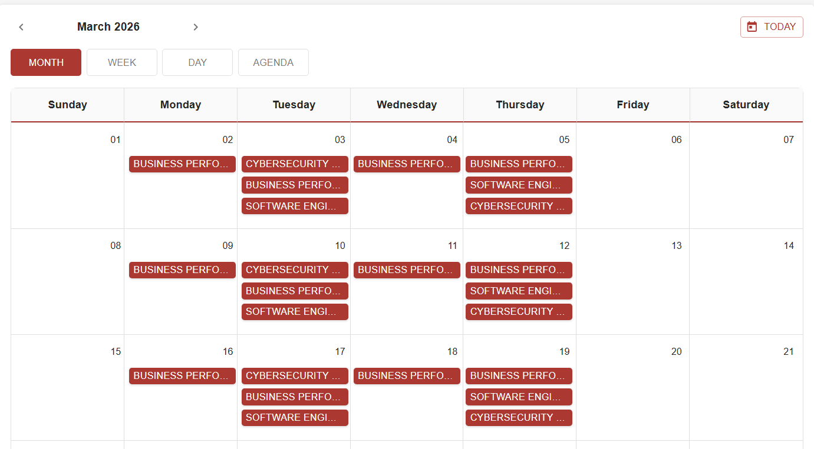
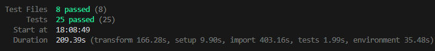

# UniBo Smart Calendar - Artifact

[](https://github.com/unibo-dtm-se-2324-UniBoSmartCalendar/artifact/actions/workflows/ci.yml)
[](LICENSE)
[](package.json)
[](package.json)

> **Modern Academic Scheduling Solution** for the University of Bologna. View, manage, and export your lecture schedule with automatic conflict resolution.

---

## Project Preview

| **User Interface** | **Quality Assurance** |
|:---:|:---:|
|  |  |
| *Dashboard interattiva con gestione conflitti* | *Test Suite automatizzata con Vitest* |

---

## Overview
**UniBo Smart Calendar** addresses the issue of fragmented university schedules. Unlike the standard portal, this application aggregates course data, detects temporal overlaps ("conflicts"), and allows students to generate a personalized study plan exportable in`.ICS`.

### Key Features
* **Conflict Detection Engine:** Proprietary algorithm that identifies and visually flags overlaps between lectures.
* **Smart Parsing:** Backend engine that normalizes raw data coming from university servers.
* **Local Caching:** Intelligent caching system to ensure instant access even when offline
* **Cross-Platform Export:** Native compatibility with Google Calendar, Outlook, and Apple Calendar.

---

## Architecture

The project follows a **Monorepo** architecture based on a modern JavaScript stack.

### Tech Stack
* **Frontend:** React 18, Material UI (MUI v5), React Big Calendar.
* **Backend:** Node.js, Express (Proxy & Parsing Logic).
* **Testing:** Vitest (Unit & Integration), React Testing Library.
* **CI/CD:** GitHub Actions (Automated Testing & Build Checks).

### Data Flow
1.  **Client (React):** Requests data through modular API services (`src/services`).
2.  **Proxy Server (Express):** Intercepts the request, downloads the original `.ICS`files from the University, and processes them.
3.  **Parser:** Cleans the data and calculates metadata.
4.  **Client:** Receives the clean JSON, applies the conflict algorithm (`conflictUtils.js`) and renders the UI.

---

## Setup & Installation

Follow this guide to set up the development environment in less than 2 minutes.

### Prerequisites
* Node.js (v18 o superiore)
* npm (v9 o superiore)

### 1. Installation
Clone the repository and install dependencies (both client and server):

```bash
git clone [https://github.com/unibo-dtm-se-2324-UniBoSmartCalendar/artifact.git](https://github.com/unibo-dtm-se-2324-UniBoSmartCalendar/artifact.git)
cd artifact
npm install
```
### 2. Development (Dev)
PTo launch the application in development mode (Server + Client in parallel):
```bash
npm start
```
* Frontend: http://localhost:3000

* Backend API: http://localhost:3001

### 3. Testing
To run the full test suite (Unit & Integration):
```bash
npm test
```

### 4. Build
To compile the project for production:
```bash
npm run build
```

## The Team
Developed for the Software Engineering course (A.Y. 2023/2024) by:
* **Alessandro De Faveri**: Backend Engineer & Logic
* **Simone Mastria**: DevOps & QA Specialist
* **Giulia Rizzo**: Frontend Architect & UI/UX

## Licence 
This project is distributed under the MIT License. See the file LICENSE for more details.
