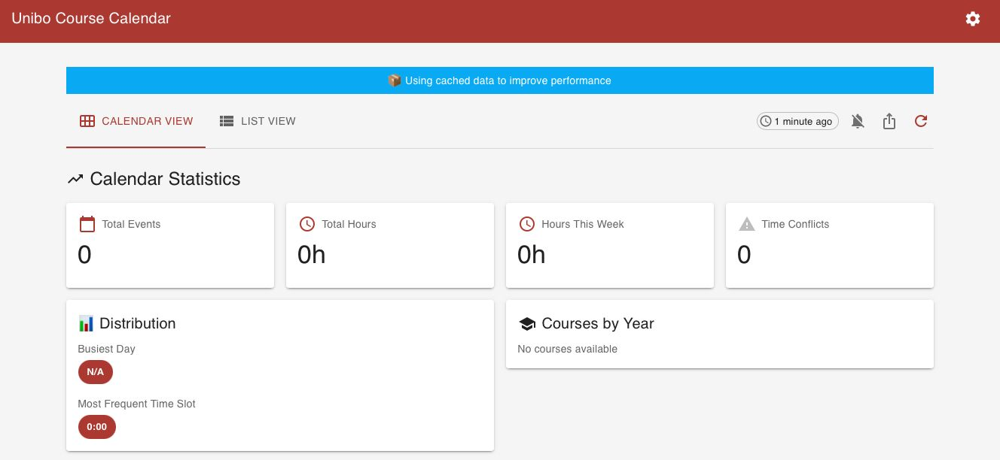
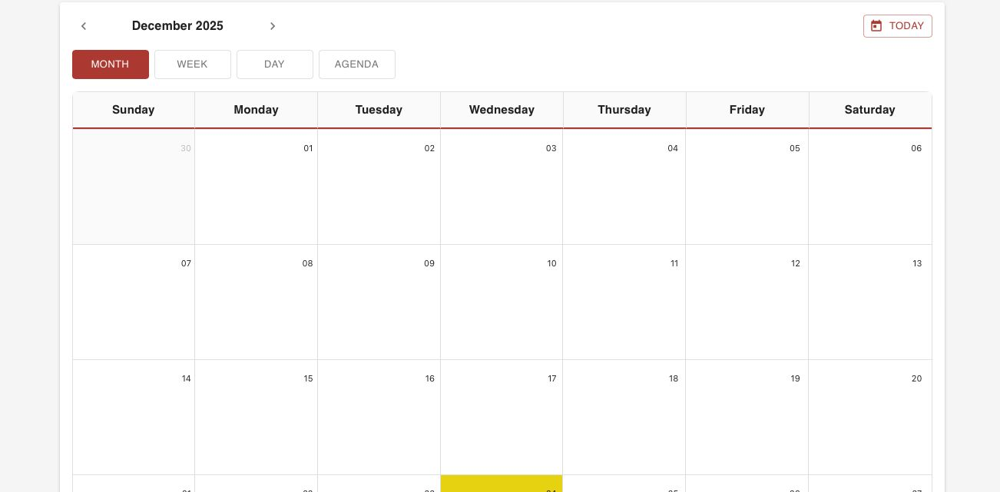
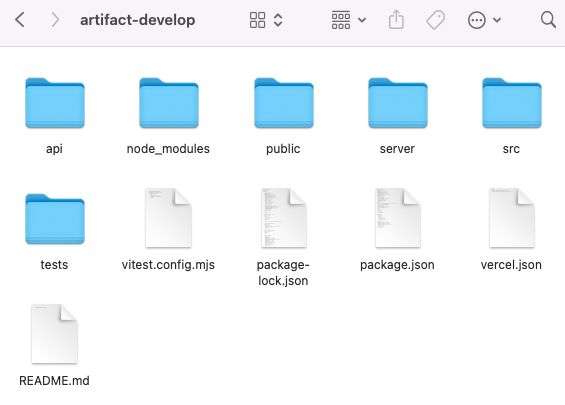

# UniBo Smart Calendar – Artifact

## Badges


## Overview

**UniBo Smart Calendar** is an application designed to simplify the management of university commitments, offering a modern, responsive, and easily extensible UI. This artifact contains the frontend developed in **React**, together with the build, test, and Continuous Integration configuration.
The goal is to provide clear and comprehensive documentation for users, evaluators, and developers.

The project was developed using React, a JavaScript library designed to build dynamic and modular user interfaces.  
It was chosen for this project because:
- **Component-based**: every part of the interface is a reusable component.
- **Virtual DOM**: efficient updates and high performance.
- **Mature ecosystem**: tools such as Vite, Jest, React Testing Library.
- **Scalability**: perfect for collaborative and easily extensible projects.

## Project Strcture

artifact/  
├── src/ <br>
│    ├── components/ <br>
│    ├── pages/           
│    ├── assets/          
│    ├── App.jsx           
│    ├── main.jsx          
│    └── styles/          
├── public/              
├── package.json          
├── package-lock.json       
├── vite.config.js        
└── README.md          

## Installation

Ensure you have the following installed:
- Node.js (LTS version recommended)
- npm (included with Node)

1. Clone the repository and enter into the folder
```bash
git clone https://github.com/unibo-dtm-se-2324-UniBoSmartCalendar/artifact.git
cd artifact
```

2. Installation 
```bash
npm install
```

3. Run the server
```bash
npm start
```

4. Build for production
```bash
npm run build
```

After the “start” command, the server will start on the specified port. Navigate to the browser to view the application.

## Application description

- Header: The project title is located at the top left. On the right is a gear icon for settings.
- Information Banner: A blue bar indicates that the app is using cached data to improve performance, a technical detail that suggests excellent state management (perhaps using React Query or Redux).
- Display Controls: There is a selector to switch between Calendar View (active) and List View. On the right, buttons indicate the last update (1 minute ago) and allow you to update the data manually.

The interface uses a card system to summarize the main data:
- Quick Metrics: Four tabs show the total number of events, total class hours, hours scheduled for the current week, and any schedule conflicts (overlaps).
- Distribution Analysis: A larger card analyzes the “Busiest Day” and the “Most Frequent Time Slot.” Currently, the data is zero or “N/A,” indicating an empty state.
- Courses by Year: A section dedicated to dividing the study load according to the academic year.

 <br>
 <br>

 
## License 

This project is distributed under the MIT license.
You may reuse, modify, and distribute it freely, provided you retain the copyright notice.


